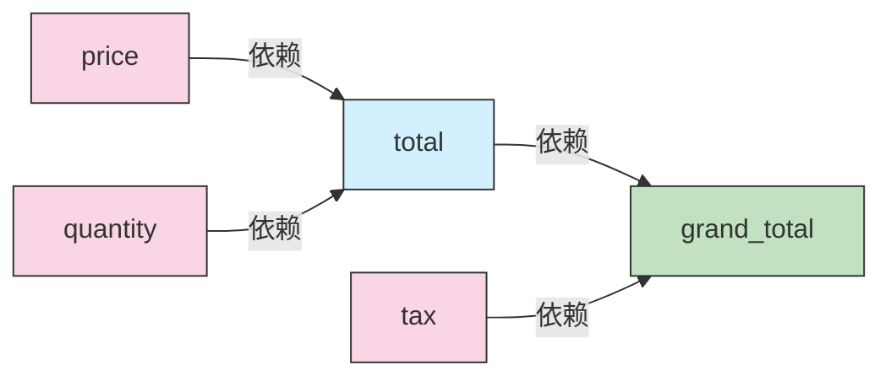
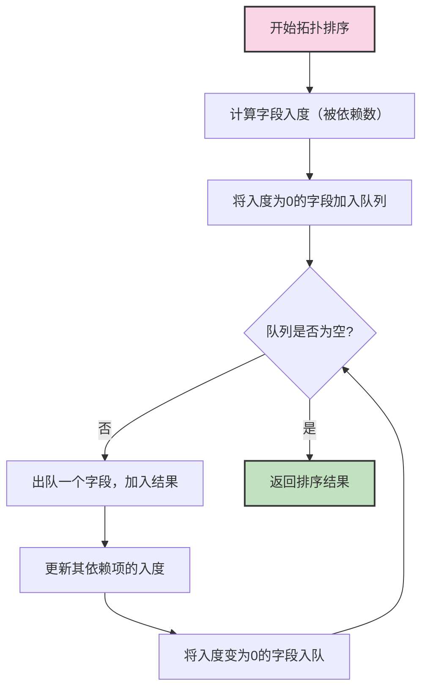
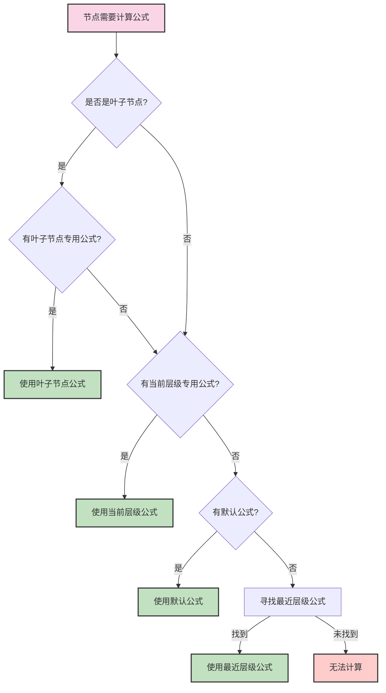
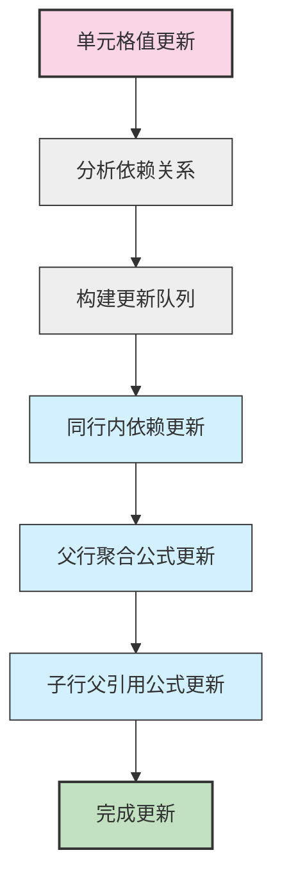

# Grid Table 公式系统

一个强大、灵活的表格公式系统，支持层级数据结构、多层级公式配置、智能依赖跟踪和高效计算。

## 特性

- ✅ **多层级公式配置** - 为不同层级、不同类型的节点配置不同的计算公式
- ✅ **智能依赖跟踪** - 自动识别字段间依赖关系，确保正确的计算顺序
- ✅ **高效更新策略** - 只重新计算受影响的值，最小化性能开销
- ✅ **丰富的函数支持** - 包括聚合函数、递归函数、条件判断等
- ✅ **层级数据支持** - 完美支持树形结构数据的计算需求

## 安装

```bash
npm install @grid-table/core
```

## 基础用法

```typescript
import { FormulaManager } from '@grid-table/core';

// 创建公式管理器实例
const formulaManager = new FormulaManager(gridApi);

// 配置列定义
formulaManager.setColumnDefs([
  { 
    field: 'total', 
    formula: 'price * quantity' 
  },
  {
    field: 'tax',
    formula: 'total * 0.1'
  }
]);

// 计算所有行的公式
formulaManager.processAllRows();

// 处理单元格更新
const updates = formulaManager.processUpdate(updatedNode, 'price');
```

## 公式配置

### 基础公式

最简单的配置方式，为字段定义一个适用于所有节点的公式：

```typescript
{
  field: 'total',
  formula: 'price * quantity' // 简单的乘法公式
}
```

### 多层级公式

针对不同级别的节点配置不同的计算逻辑：

```typescript
{
  field: 'stock',
  levelFormulas: [
    { level: 0, formula: 'SUM(children, "stock")' },  // 根节点：汇总直接子节点库存
    { level: 1, formula: 'SUMALL(children, "stock")' },  // 一级节点：递归汇总所有后代节点库存
    { isLeaf: true, formula: 'quantity' }  // 叶子节点：使用quantity字段值作为库存
  ]
}
```

## 支持的函数

### 聚合函数

| 函数      | 描述                      | 示例                       |
|----------|--------------------------|----------------------------|
| SUM      | 计算直接子节点字段总和        | `SUM(children, "price")`   |
| SUMALL   | 递归计算所有后代节点字段总和   | `SUMALL(children, "price")` |
| AVG      | 计算直接子节点字段平均值      | `AVG(children, "price")`    |
| AVGALL   | 递归计算所有后代节点字段平均值  | `AVGALL(children, "price")` |
| COUNT    | 计算直接子节点数量           | `COUNT(children)`          |
| COUNTALL | 递归计算所有后代节点数量      | `COUNTALL(children)`       |

### 条件函数

| 函数 | 描述            | 示例                              |
|-----|----------------|-----------------------------------|
| IF  | 条件判断三元运算符 | `IF(price > 100, price * 0.9, price)` |

### 节点类型函数

| 函数    | 描述            | 示例                         |
|--------|----------------|------------------------------|
| ISLEAF | 判断是否为叶子节点 | `IF(ISLEAF(), quantity, SUM(children, "total"))` |
| ISROOT | 判断是否为根节点   | `IF(ISROOT(), 0, parent.tax + tax)` |
| LEVEL  | 返回节点层级      | `IF(LEVEL() > 2, price * 0.8, price)` |

## 核心概念解析

### 依赖跟踪

公式系统通过分析公式字符串，自动提取并构建字段间的依赖关系图。系统支持三种类型的依赖：

1. **同行内字段依赖** - 如 `total = price * quantity`
2. **父节点字段依赖** - 如 `discount = parent.discount_rate * price`
3. **子节点字段依赖** - 如 `total_stock = SUM(children, "stock")`

依赖图结构示例：



代码实现：
```typescript
// 维护一个映射，记录每个字段被哪些字段依赖
private dependencyGraph: Map<string, Set<string>> = new Map();

private updateDependencyGraph(field: string, dependencies: string[]): void {
  dependencies.forEach(dep => {
    if (!this.dependencyGraph.has(dep)) {
      this.dependencyGraph.set(dep, new Set());
    }
    this.dependencyGraph.get(dep)!.add(field);
  });
}

// 提取公式中的依赖字段
private extractDependencies(parsed: Expression, formula: string): string[] {
  // 基础依赖 (直接变量引用)
  const simpleDependencies = parsed.variables();

  // 复杂依赖 (parent. & children.)
  const complexDependencies = [];
  const parentRegex = /parent\.(\w+)/g;
  const childrenRegex = /children\.(\w+)/g;
  let match;
  while(match = parentRegex.exec(formula)) {
    complexDependencies.push(match[0]);
  }
  while(match = childrenRegex.exec(formula)) {
    complexDependencies.push(match[0]);
  }
  return [...simpleDependencies, ...complexDependencies];
}
```

### 拓扑排序

拓扑排序确保字段按照依赖关系的顺序计算，即先计算那些其他字段依赖的基础字段，然后再计算依赖于它们的字段。



代码实现：
```typescript
private topologicalSortFields(graph: Map<string, Set<string>>): string[] {
  // 计算每个字段的入度（被依赖数）
  const inDegree = new Map<string, number>();
  
  // 初始化所有字段的入度为0
  for (const field of graph.keys()) {
    inDegree.set(field, 0);
  }
  
  // 计算每个字段的入度
  for (const dependents of graph.values()) {
    for (const dependent of dependents) {
      inDegree.set(dependent, (inDegree.get(dependent) || 0) + 1);
    }
  }
  
  // 找出所有入度为0的字段（无依赖的字段）
  const queue: string[] = [];
  for (const [field, degree] of inDegree) {
    if (degree === 0) {
      queue.push(field);
    }
  }
  
  const result: string[] = [];
  
  // 拓扑排序主循环
  while (queue.length > 0) {
    const current = queue.shift()!;
    result.push(current);
    
    // 更新依赖于当前字段的所有字段的入度
    const dependents = graph.get(current) || new Set();
    for (const dependent of dependents) {
      const newDegree = inDegree.get(dependent)! - 1;
      inDegree.set(dependent, newDegree);
      
      if (newDegree === 0) {
        queue.push(dependent);
      }
    }
  }
  
  return result;
}
```

### 多层级公式处理

系统通过分析节点的层级、是否为叶子节点等信息，选择最合适的公式进行计算。



代码实现：
```typescript
private getApplicableFormulaForNode(node: RowNode, levelMap: Map<number, any>): any {
  // 计算当前节点级别
  let level = 0;
  let parent = node.parent;
  while (parent) {
    level++;
    parent = parent.parent;
  }
  
  // 检测是否为叶子节点
  const isLeafNode = !node.children || node.children.length === 0;
  
  // 查找叶子节点专用公式
  let formulaInfo = null;
  if (isLeafNode) {
    // 查找isLeaf=true的公式
    for (const [_, info] of levelMap) {
      if (info.isLeaf) {
        formulaInfo = info;
        break;
      }
    }
  }
  
  // 如果没有找到叶子节点专用公式，则按层级查找
  if (!formulaInfo) {
    formulaInfo = levelMap.get(level);
    
    // 如果没有当前层级的公式，尝试默认公式
    if (!formulaInfo) {
      formulaInfo = levelMap.get(-1); // 尝试默认公式
      
      // 如果没有默认公式，尝试最近层级的公式
      if (!formulaInfo) {
        let nearestLevel = -1;
        let minDistance = Infinity;
        
        levelMap.forEach((info, lvl) => {
          if (lvl >= 0 && !info.isLeaf) {
            const distance = Math.abs(lvl - level);
            if (distance < minDistance) {
              minDistance = distance;
              nearestLevel = lvl;
            }
          }
        });
        
        if (nearestLevel >= 0) {
          formulaInfo = levelMap.get(nearestLevel);
        }
      }
    }
  }
  
  return formulaInfo;
}
```

### 高效的更新策略

当单元格值发生变化时，系统会分析依赖关系，只更新受影响的字段，而非全量重新计算。



代码实现：
```typescript
public processUpdate(rowNode: RowNode, updatedField: string): Map<RowNode, Set<string>> {
  const updates = new Map<RowNode, Set<string>>();
  const queue: {node: RowNode, field: string}[] = [{ node: rowNode, field: updatedField }];
  const visited = new Set<string>(); // key: `${node.id}-${field}`

  while(queue.length > 0) {
    const { node, field } = queue.shift()!;
    const visitKey = `${node.id}-${field}`;

    if (visited.has(visitKey)) continue;
    visited.add(visitKey);

    // 1. 同行内的依赖更新 (向下)
    const dependents = this.dependencyGraph.get(field);
    if (dependents) {
      dependents.forEach(dependentField => {
        // 更新当前节点的依赖字段
        if (this.updateField(node, dependentField)) {
          if (!updates.has(node)) updates.set(node, new Set());
          updates.get(node)!.add(dependentField);
          queue.push({ node: node, field: dependentField });
        }
      });
    }

    // 2. 对父行的聚合公式更新 (向上)
    if (node.parent) {
      // 找到并更新受影响的父节点字段
      this.updateParentFields(node, field, queue, updates);
    }

    // 3. 对子行的父引用公式更新 (向下)
    if (node.children && node.children.length > 0) {
      // 找到并更新受影响的子节点字段
      this.updateChildrenFields(node, field, queue, updates);
    }
  }
  
  return updates;
}
```

## 实战示例

### 基本产品定价表

```typescript
const columnDefs = [
  { field: 'name' },
  { field: 'quantity' },  // 可编辑
  { field: 'price' },     // 可编辑
  { 
    field: 'total',
    formula: 'price * quantity'
  },
  { 
    field: 'tax',
    formula: 'total * 0.1'  // 10%税率
  },
  { 
    field: 'totalWithTax',
    formula: 'total + tax'
  }
];
```

### 复杂库存管理系统

```typescript
const columnDefs = [
  { field: 'name' },
  { field: 'quantity' },  // 只在叶子节点可编辑
  { 
    field: 'stockValue',
    formula: 'quantity * unitPrice'  // 基础公式
  },
  { 
    field: 'stock',
    // 多层级公式配置
    levelFormulas: [
      { level: 0, formula: 'SUM(children, "stock")' },  // 根节点：总库存=所有直接子类别库存之和
      { level: 1, formula: 'SUMALL(children, "stock")' },  // 一级类别：总库存=递归所有子产品库存之和
      { isLeaf: true, formula: 'quantity' }  // 叶子节点：实际商品的库存就是quantity
    ]
  },
  {
    field: 'stockAlert',
    formula: 'IF(stock < minStock, "补货", "正常")'  // 条件判断
  }
];
```

## 性能优化

1. **智能更新** - 只重新计算受影响的字段
2. **拓扑排序** - 确保高效的计算顺序
3. **公式缓存** - 避免重复解析公式
4. **分批处理** - 处理大型数据集时分批执行计算

## 高级用法

### 自定义函数

可以扩展 FormulaManager 类，添加自定义函数：

```typescript
class ExtendedFormulaManager extends FormulaManager {
  constructor(api) {
    super(api);
    
    // 添加自定义函数
    this.parser.functions.DISCOUNT = (price, rate) => {
      return price * (1 - rate);
    };
  }
}
```

### 与外部系统集成

公式系统可以与外部数据源或API集成，实现动态计算：

```typescript
// 扩展公式管理器，添加外部API集成
class ApiFormulaManager extends FormulaManager {
  private cachedExchangeRates: Record<string, number> = {};
  
  constructor(api) {
    super(api);
    
    // 添加汇率转换函数
    this.parser.functions.CONVERT_CURRENCY = async (amount, fromCurrency, toCurrency) => {
      const rate = await this.getExchangeRate(fromCurrency, toCurrency);
      return amount * rate;
    };
  }
  
  private async getExchangeRate(from: string, to: string): Promise<number> {
    const key = `${from}_${to}`;
    
    if (!this.cachedExchangeRates[key]) {
      // 从外部API获取汇率
      const response = await fetch(`https://api.example.com/exchange?from=${from}&to=${to}`);
      const data = await response.json();
      this.cachedExchangeRates[key] = data.rate;
    }
    
    return this.cachedExchangeRates[key];
  }
}
```

## 调试技巧

### 启用日志

FormulaManager 提供内置的日志功能，帮助调试复杂公式：

```typescript
// 启用详细日志
const formulaManager = new FormulaManager(gridApi);
formulaManager.setDebugMode(true);

// 追踪特定字段的计算
formulaManager.trackField('total');
```

### 检查依赖关系

```typescript
// 打印依赖图
console.log(formulaManager.getDependencyGraph());

// 检查特定字段的依赖
console.log(formulaManager.getDependencies('totalWithTax'));
```

## 常见问题

### 1. 循环依赖

公式系统会自动检测并警告循环依赖，例如：
- A依赖B，B依赖C，C依赖A

当检测到循环依赖时，系统会尝试打破循环，但可能导致计算结果不准确。

### 2. 大型数据集性能

处理大型数据集时，考虑：
- 使用更简单的公式
- 减少不必要的依赖
- 限制树的深度
- 分批处理数据

### 3. 公式错误处理

系统会捕获公式执行过程中的错误，如除以零、类型错误等，并返回undefined或默认值。可以通过自定义错误处理来增强这一行为：

```typescript
formulaManager.setErrorHandler((error, field, node) => {
  console.error(`Error in ${field} for node ${node.id}:`, error);
  return 0; // 默认返回值
});
```

## 贡献与支持

欢迎提交问题和功能请求到 GitHub Issues 页面，或直接贡献代码改进。

## 许可证

MIT